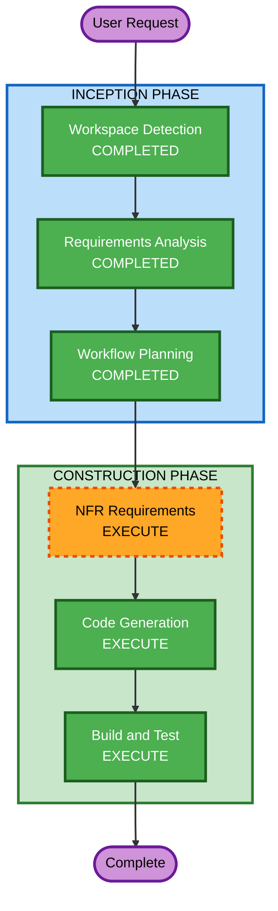

# Execution Plan — OURTECH Website

## Detailed Analysis Summary

### Change Impact Assessment
- **User-facing changes**: Yes — New public-facing corporate website
- **Structural changes**: N/A — Greenfield project
- **Data model changes**: No — No database, static content only
- **API changes**: No — Client-side SPA with third-party form service
- **NFR impact**: Yes — Performance, security headers, accessibility required

### Risk Assessment
- **Risk Level**: Low (greenfield, no existing systems affected)
- **Rollback Complexity**: Easy (static site, can redeploy any version)
- **Testing Complexity**: Moderate (PBT + security extensions enabled)

---

## Workflow Visualization



### Text Alternative
```
Phase 1: INCEPTION
  - Workspace Detection (COMPLETED)
  - Requirements Analysis (COMPLETED)
  - Workflow Planning (COMPLETED)

Phase 2: CONSTRUCTION
  - NFR Requirements (EXECUTE)
  - Code Generation (EXECUTE)
  - Build and Test (EXECUTE)
```

---

## Phases to Execute

### INCEPTION PHASE
- [x] Workspace Detection (COMPLETED)
- [x] Requirements Analysis (COMPLETED)
- [x] User Stories (SKIPPED — single-page corporate site, no complex user personas)
- [x] Workflow Planning (COMPLETED)
- [x] Application Design (SKIPPED — straightforward SPA, no complex component interactions)
- [x] Units Generation (SKIPPED — single unit of work, no decomposition needed)

### CONSTRUCTION PHASE
- [ ] Functional Design (SKIP)
  - **Rationale**: No complex business logic; sections are content-display with a simple contact form
- [ ] NFR Requirements (EXECUTE)
  - **Rationale**: Need to formally document tech stack (React+Vite, Tailwind, fast-check), security headers, performance targets, and PBT framework selection (PBT-09 requirement)
- [ ] NFR Design (SKIP)
  - **Rationale**: NFR patterns are straightforward for a static SPA (security headers in middleware, image optimization); no complex NFR architecture needed
- [ ] Infrastructure Design (SKIP)
  - **Rationale**: Deploying to Vercel/Netlify; no custom infrastructure to design
- [ ] Code Generation (EXECUTE)
  - **Rationale**: Core implementation needed — React SPA with all sections, styling, animations, form, and tests
- [ ] Build and Test (EXECUTE)
  - **Rationale**: Build instructions, test execution, and verification needed

### OPERATIONS PHASE
- [ ] Operations (PLACEHOLDER)

---

## Unit Structure

**Single Unit**: `ourtech-website`
- React + Vite SPA
- All sections in one application
- No decomposition needed

---

## Success Criteria
- **Primary Goal**: Functional single-page corporate website for OURTECH
- **Key Deliverables**: 
  - Complete React SPA with 8 sections
  - Dark theme with tech-forward animations
  - DICT D-TAP Certificate prominently displayed
  - Simple contact form
  - Property-based tests + example-based tests
  - Security headers configured
  - Deployable to Vercel/Netlify
- **Quality Gates**:
  - All security rules compliant (SECURITY-01 through SECURITY-15 where applicable)
  - PBT rules compliant (PBT-01 through PBT-10 where applicable)
  - Lighthouse performance > 80
  - WCAG 2.1 AA target
  - Responsive across mobile/tablet/desktop
